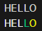

# Challenge 09 - Janky Wordle
The object of this challenge is to create your own version of wordle. The user will input a 5 letter word, receive feedback, and then guess again.

## Mild 🌶️
Create a program that satisfies the following requirements:

* The porgram has a pre selected 5 letter word.
* The user inputs a 5 letter word.
* Beneath the input word the program outputs `X` for letters not in the word, `/` for letters that are in the word, but in the wronf place, and `O` for letters that are in the correct spot. For example the output might look like this:
```python
# assume the secret word is 'WORLD'

HELLO
XXXO/
```
* The user has 5 guesses to get the correct word.
* The program prevents the user from typing invalid values and handles errors appropriately.
* The program only moves forward if input is valid.

## Medium 🌶️🌶️
Create a program that satisfies the following requirements:

* The porgram has a pre selected 5 letter word from a list of at least 3 different 5 letter words.
* The user inputs a 5 letter word.
* Beneath the input word the program outputs `X` for letters not in the word, `/` for letters that are in the word, but in the wronf place, and `O` for letters that are in the correct spot. For example the output might look like this:
```python
# assume the secret word is 'WORLD'

HELLO
XXXO/
```
* The user has 5 guesses to get the correct word.
* The program prevents the user from typing invalid values and handles errors appropriately.
* The program only moves forward if input is valid.

## Spicy 🌶️🌶️🌶️
Create a program that satisfies the following requirements:

* Look into the `colorama` library [documentation found here](https://pypi.org/project/colorama/). 
```python
# colorama example

from colorama import init, Fore, Style
init(autoreset=True) # Automatically resets color after each print
print(f"This is {Fore.RED}red{Style.RESET_ALL} text!")
print(f"This is {Fore.GREEN}green{Style.RESET_ALL} text!")
```
* The porgram has a pre selected 5 letter word from a list of at least 3 different 5 letter words.
* The user inputs a 5 letter word.
* Print the user's word again using colorama to style the letters. For example the output might look like this:



* The user has 5 guesses to get the correct word.
* The program prevents the user from typing invalid values and handles errors appropriately.
* The program only moves forward if input is valid.
